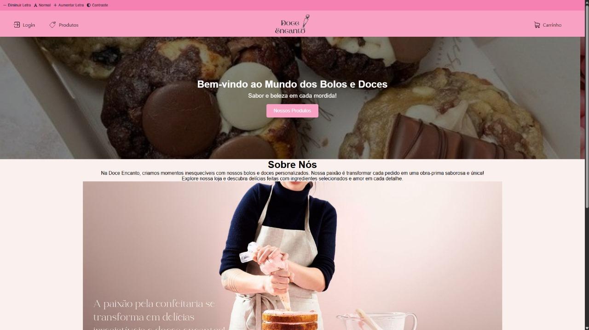

# 🎂 Doce Encanto | Loja de Bolos

Bem-vindo à *Doce Encanto*, uma loja fictícia de bolos criada como projeto acadêmico.  
Este site foi desenvolvido com *HTML, **CSS* e *JavaScript*, simulando uma experiência básica de navegação por uma confeitaria online encantadora e responsiva! 🍰

---

## 📸 Prévia

  

---

## 🚀 Funcionalidades

- 🧁 Página inicial com apresentação da loja
- 🛍 Galeria de bolos com imagens e descrições
- 📄 Páginas individuais para cada produto
- 📱 Layout responsivo para diferentes dispositivos
- ✉ Formulário de contato simples

---

## 🛠 Tecnologias Utilizadas

- *HTML5* — Estrutura do site
- *CSS3* — Estilização, layout e responsividade
- *JavaScript* — Funcionalidades básicas de interação
